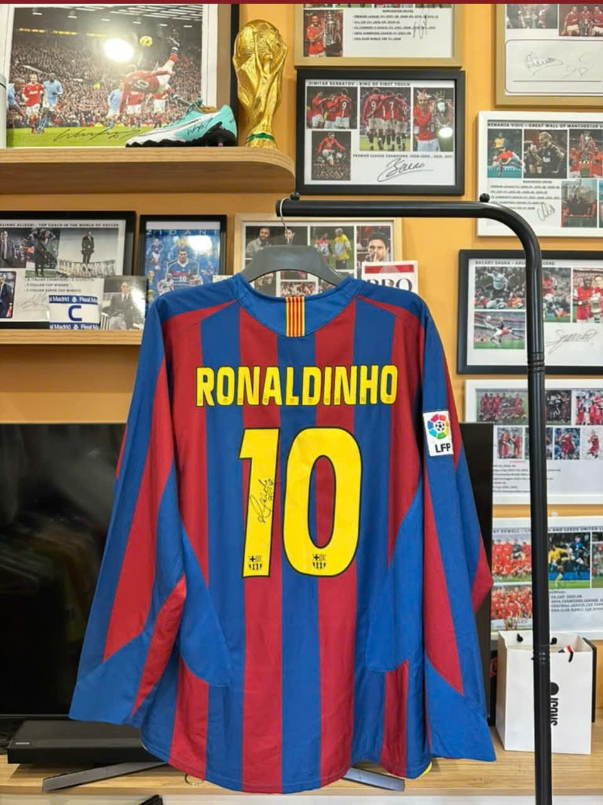

Lê gia Dương
Biệt danh: Rayan
Sinh:1/3/2007
Đội bóng yêu: Barcenola FC
Câu chuyện sưu tập:
Mọi thứ bắt đầu vào năm 2015…
Khi một cậu bé lần đầu thức đêm xem Barcelona chơi bóng.

Đó không chỉ là một trận đấu, mà là lần đầu tiên cảm nhận được thứ bóng đá đẹp đến mức khiến người ta đứng hình trước màn hình TV. Những pha phối hợp của Barca, tiếng hò reo ở Nou Camp, và đặc biệt là Neymar — chàng trai với mái tóc ngông, nụ cười tự do cùng đôi chân biết nhảy múa với trái bóng… đã khiến tình yêu ấy bắt đầu từ đó.

Từ một người chỉ đơn giản thích xem bóng đá, dần dần lại muốn giữ cho mình một thứ gì đó “thật” hơn. Không phải highlight trên Youtube, không phải ảnh trên mạng… mà là những kỷ vật thực sự chạm được bằng tay.

Rồi hành trình sưu tập áo ký bắt đầu.

Những năm 2023–2026 ở Hà Nội có lẽ là quãng thời gian đẹp nhất với một người mê bóng đá và đam mê ký ức. Khi những huyền thoại bắt đầu xuất hiện tại Việt Nam nhiều hơn. Rivaldo trở về sân Mỹ Đình — khoảnh khắc mà trước đây chỉ nghĩ có thể nhìn qua TV. Ronaldinho xuất hiện trong một sự kiện hãng bia, vẫn nụ cười ấy, vẫn sự tự do ấy như thời đỉnh cao Barca.

Và rồi từng chiếc áo có chữ ký bắt đầu xuất hiện trong bộ sưu tập…

Không chỉ Barca.
Còn có những huyền thoại của Man Đỏ, những danh thủ từng làm rung động cả tuổi thơ của một thế hệ. Mỗi chữ ký không đơn giản là mực trên vải. Nó là một phần ký ức. Là cảm giác hồi hộp khi đứng giữa đám đông chờ thần tượng xuất hiện. Là những ngày chạy khắp Hà Nội chỉ để tìm cơ hội gặp một cầu thủ mình từng xem qua màn hình từ bé.

Có những chiếc áo rất đắt.
Nhưng giá trị thật sự chưa bao giờ nằm ở tiền.

Giá trị nằm ở câu chuyện phía sau nó.
Là tuổi trẻ.
Là đam mê.
Là cảm giác một giấc mơ thời bé đang dần được tự tay chạm tới.

Và đến hôm nay, nhìn lại bộ sưu tập ấy…
Điều đẹp nhất không phải là mình đang sở hữu bao nhiêu chiếc áo ký.

Chiếc áo ký đầu tiên của tôi là chiếc ronaldinho
